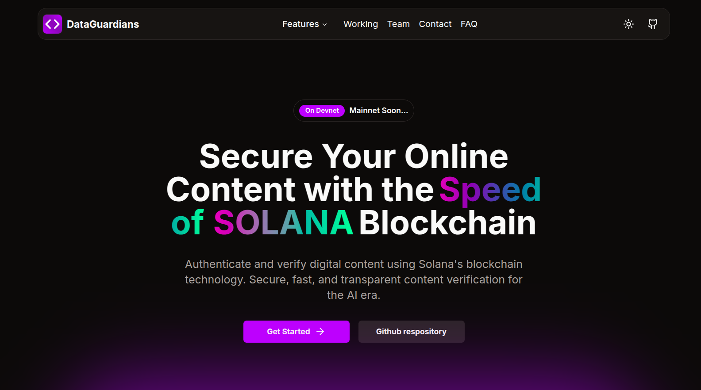

# DataGuardians

Content Authentication: Combatting Deepfakes with Digital Signatures on Solana



## Overview

DataGuardians is a decentralized platform for content authentication and verification built on the Solana blockchain. It provides creators with powerful tools to attest ownership of their digital content, create verifiable licenses, and protect their work from misuse and misattribution in an era of AI-generated deepfakes and misinformation.

## Table of Contents

- [Features](#features)
- [How It Works](#how-it-works)
- [Benefits](#benefits)
- [Technology Stack](#technology-stack)
- [Getting Started](#getting-started)
- [Usage Guide](#usage-guide)
- [Development](#development)
- [License](#license)

## Features

- **Content Attestation**: Securely register your digital content on the Solana blockchain with cryptographic signatures.
- **Decentralized Storage**: Store your content on IPFS for immutable, decentralized access.
- **Content Licensing**: Define clear usage rights with customizable licenses linked to your attestations.
- **Verification Badges**: Embed verification badges on your website or content platforms to prove authenticity.
- **cNFT Minting**: Create compact NFTs that represent ownership and authenticity of your content.
- **User-Friendly Interface**: Simplified dashboard for uploading, attesting, and licensing content.

## How It Works

1. **Connect Wallet**: Users start by connecting their Solana wallet (Phantom, Sollet, or Solflare).
2. **Upload Content**: Upload digital content (images, audio, documents, video) to be stored on IPFS.
3. **Create Attestation**: Sign the content with your wallet's private key to create a permanent record on the Solana blockchain.
4. **Set License Terms**: Define how others can use your content by selecting license terms.
5. **Share Verification**: Receive a verification badge and embed code to prove content authenticity.

### Technical Flow

1. Content is uploaded to IPFS via Pinata, generating a unique Content Identifier (CID).
2. Metadata is created and also uploaded to IPFS.
3. The Solana program creates a Program Derived Address (PDA) for the attestation.
4. A blockchain transaction is signed by the creator, registering the content's hash and metadata.
5. An optional cNFT is minted to represent the content attestation.
6. License terms are recorded and linked to the attestation.

## Benefits

### For Content Creators
- **Ownership Proof**: Establish clear provenance and timestamp of content creation.
- **Protect Against Theft**: Prevent unauthorized use of your creative work.
- **Licensing Control**: Clearly define and enforce usage rights.
- **Combat Deepfakes**: Distinguish authentic content from AI-generated imitations.
- **Revenue Protection**: Ensure proper attribution and potential revenue streams.

### For Content Consumers
- **Verification**: Easily verify the authenticity of content.
- **Trust**: Distinguish between genuine and fake content.
- **Clear Rights**: Understand usage permissions clearly.
- **Ethical Usage**: Support creators by respecting their defined licenses.

### For the Ecosystem
- **Fighting Misinformation**: Create a reliable verification framework for digital content.
- **Creator Economy**: Strengthen the foundation for a sustainable creator economy.
- **Decentralization**: Reduce reliance on centralized authentication systems.
- **Speed & Efficiency**: Leverage Solana's high-speed, low-cost blockchain.

## Technology Stack

- **Frontend**: Next.js, React, TailwindCSS, shadcn/ui
- **Blockchain**: Solana (Program written in Rust with Anchor framework)
- **Storage**: IPFS via Pinata
- **Authentication**: Solana Wallet Adapter
- **NFT Standard**: Metaplex for cNFT creation

## Getting Started

### Prerequisites
- Node.js (v16 or later)
- Solana CLI (optional, for development)
- A Solana wallet (Phantom, Solana, etc.)

### Installation

1. Clone the repository:
```bash
git clone https://github.com/yourusername/data-guardians.git
cd data-guardians
```

2. Install dependencies:
```bash
npm install
```

3. Create a `.env.local` file with your API keys:
```
NEXT_PUBLIC_SOLANA_RPC_URL=https://api.devnet.solana.com
NEXT_PUBLIC_PINATA_JWT=your_pinata_jwt_here
```

4. Run the development server:
```bash
npm run dev
```

5. Open [http://localhost:3000](http://localhost:3000) in your browser.

## Usage Guide

### Attestation Process
1. Connect your wallet using the "Connect Wallet" button.
2. Navigate to the "Upload" tab and upload your content.
3. Add a title and description to your content.
4. Submit the form to upload to IPFS.
5. Navigate to the "Attest" tab to create a blockchain attestation.
6. Sign the transaction with your wallet to create the attestation.
7. Optional: Mint a cNFT representing your content attestation.

### Licensing Process
1. After attestation, navigate to the "License" tab.
2. Choose a license type (Open, Restricted, Commercial, Research, or Custom).
3. Configure license options:
   - Attribution requirements
   - Commercial use permissions
   - AI training permissions
   - Expiration date (if any)
   - Custom terms (for custom licenses)
4. Create the license and receive a license badge.

### Verification
1. Share your verification badge on your website, social media, or content platforms.
2. Others can verify your content's authenticity by clicking the badge.
3. The verification page displays the creator's address, timestamp, and content information.

## Development

### Solana Program
The core attestation logic is implemented in a Solana program written using the Anchor framework. The program:
1. Creates attestation accounts for each piece of content
2. Links attestations to creator wallets
3. Stores metadata references and timestamps
4. Emits events for off-chain indexing

### Deployment
The project is currently deployed on Solana Devnet. To deploy to mainnet:
1. Update the RPC URLs in the configuration
2. Deploy the program to mainnet
3. Update the program ID references

## License

This project is licensed under the MIT License - see the [LICENSE](LICENSE) file for details.

## Contributing

Contributions are welcome! Please feel free to submit a Pull Request.

## Contact

For questions or support, please open an issue on GitHub or contact us at [rishavmehra61@gmail.com](mailto:rishavmehra61@gmail.com).

---

Built with ❤️ by Rishav Mehra